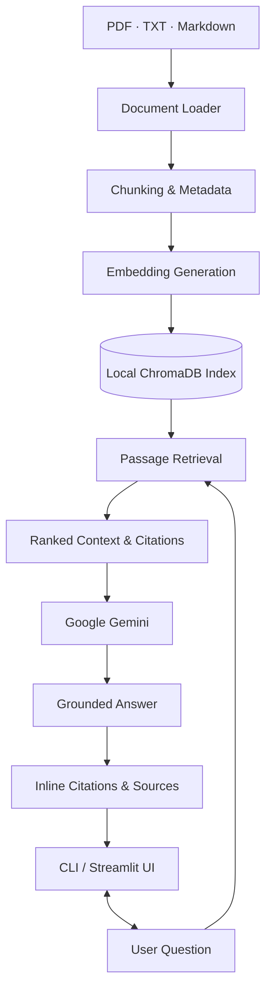

# 🔎 RAG Research Assistant

### Ask questions about your documents. Get answers backed by sources.

A document-grounded AI research assistant that transforms PDFs, text files, and Markdown documents into a searchable knowledge base. Powered by **Retrieval-Augmented Generation (RAG), ChromaDB, and Google Gemini**, it retrieves relevant passages and generates answers with traceable citations.

Instead of relying entirely on a language model's general knowledge, the assistant uses retrieved document content to ground its responses and identifies the source files and PDF pages where available.

---

## ✨ Key Features

* 📄 **Multi-Format Document Ingestion** — Load PDF, TXT, and Markdown files.
* 🔍 **Semantic Search** — Retrieve relevant passages using Sentence Transformers embeddings.
* 🧠 **Grounded AI Responses** — Generate answers using retrieved context with Google Gemini.
* 📚 **Source-Level Citations** — Link numbered references to original files and PDF page numbers where available.
* 💾 **Local-First Storage** — Persist documents' search index locally using ChromaDB.
* 🔄 **Automatic Retrieval Fallback** — Use TF-IDF when Sentence Transformers is unavailable.
* ⚡ **Incremental Ingestion** — Skip files that have already been indexed during subsequent ingestion runs.
* 💻 **Dual Interface** — Interact through a command-line interface or a Streamlit web application.
* 🧪 **Testing Support** — Unit tests for document chunking and core pipeline behavior.
* ⚙️ **Configurable Pipeline** — Adjust chunk size, overlap, retrieval count, embedding model, and generation settings.

## 🏗️ System Architecture



**Data flow:** Documents are processed into chunks and indexed locally. When a question is submitted, the retriever selects relevant passages, and the Gemini API generates an answer using that context. Source metadata is used to construct citations.

**Privacy note:** The document collection and index are stored locally, but retrieved passages and the question are sent to Google Gemini for answer generation.

## 🛠️ Technology Stack

| Component           | Technologies                                         |
| ------------------- | ---------------------------------------------------- |
| Language            | Python 3.10+                                         |
| LLM                 | Google Gemini API                                    |
| RAG Pipeline        | Retrieval, context construction, grounded generation |
| Vector Database     | ChromaDB                                             |
| Semantic Embeddings | Sentence Transformers                                |
| Fallback Retrieval  | TF-IDF                                               |
| Document Processing | PDF, TXT, Markdown                                   |
| Frontend            | Streamlit                                            |
| Testing             | pytest                                               |
| Configuration       | Python configuration and environment variables       |

## 📂 Project Structure

```text
rag-research-assistant/
├── app.py                    # Streamlit interface
├── main.py                   # CLI entry point
├── config.py                 # Application settings
├── requirements.txt
├── .env.example
├── src/
│   ├── ingest.py             # Loading and chunking
│   ├── embeddings.py          # Embedding backends
│   ├── vectorstore.py         # ChromaDB operations
│   ├── retriever.py           # Relevant passage retrieval
│   ├── llm.py                 # Gemini integration
│   ├── rag_pipeline.py        # End-to-end RAG pipeline
│   └── utils.py               # Logging and source formatting
├── scripts/
│   └── ingest_documents.py
├── data/
│   └── documents/             # Your source documents
├── tests/
│   └── test_pipeline.py
└── .chroma_db/                # Generated local index
```

## 🚀 Getting Started

### 1. Clone the repository

```bash
git clone https://github.com/Karthik236990/rag-research-assistant.git
cd rag-research-assistant
```

Replace the repository URL if your GitHub repository uses a different name.

### 2. Create a virtual environment

**Windows PowerShell**

```powershell
py -m venv .venv
.\.venv\Scripts\Activate.ps1
```

**macOS / Linux**

```bash
python3 -m venv .venv
source .venv/bin/activate
```

### 3. Install dependencies

```bash
python -m pip install --upgrade pip
pip install -r requirements.txt
```

### 4. Configure the Gemini API

Create an API key through [Google AI Studio](https://aistudio.google.com/) and configure your environment.

```powershell
Copy-Item .env.example .env
```

Add your API key to `.env`:

```env
GEMINI_API_KEY=your_api_key_here
```

Keep your API key private. Never commit `.env` to GitHub.

### 5. Add your documents

Place supported files inside:

```text
data/documents/
```

Supported formats: `.pdf`, `.txt`, and `.md`.

### 6. Build the search index

```bash
python main.py ingest
```

The application loads documents, creates overlapping chunks, generates embeddings, and persists the index.

### 7. Ask questions

**One-time question**

```bash
python main.py ask "What are the main findings in the report?"
```

**Interactive terminal chat**

```bash
python main.py chat
```

**Launch the web interface**

```bash
streamlit run app.py
```

## 💬 Example Interaction

**Question**

> What does the report say about renewable energy adoption?

**Illustrative response**

Renewable energy adoption increased year over year, primarily due to residential solar additions [1]. Wind power growth was limited by permitting delays [2].

**Sources**

* [1] `energy_report_2024.pdf` — Page 4
* [2] `energy_report_2024.pdf` — Page 9

*This is an illustrative example of the citation format, not a benchmark or a verified result from a test run.*

## ⚙️ How It Works

1. **Ingest:** Load documents and split their content into overlapping chunks.
2. **Embed:** Generate semantic embeddings using Sentence Transformers, with TF-IDF as a fallback.
3. **Index:** Store searchable vectors and source metadata in ChromaDB.
4. **Retrieve:** Select the most relevant passages for a user's question.
5. **Generate:** Send the question and retrieved context to Gemini with instructions to answer from the provided evidence.
6. **Cite:** Return the response with numbered references mapped to source files and available PDF page numbers.

If the retrieved evidence does not contain an answer, the assistant is instructed to say that the documents do not provide enough information rather than inventing a response.

## 🧪 Testing

Run the test suite:

```bash
pytest -q
```

Run the pipeline tests specifically:

```bash
pytest -q tests/test_pipeline.py
```

## 🔐 Privacy & Limitations

* Source documents and the ChromaDB index are stored locally.
* Questions and retrieved passages are sent to the Gemini API during answer generation.
* Semantic embeddings require an initial model download; subsequent local embedding and retrieval operations can run without a network connection, subject to the installed backend.
* Gemini generation requires internet access and is subject to API quotas and rate limits.
* Scanned or image-only PDFs require OCR, which is not included by default.
* TF-IDF may be less effective than semantic embeddings for paraphrased queries.
* Citations improve traceability but do not guarantee that a generated answer correctly interprets the source.

Do not use confidential documents without appropriate authorization, and verify important conclusions against the original material.

## 🗺️ Roadmap

Potential future improvements:

* [ ] Add document-level filtering and metadata-based search.
* [ ] Support OCR for scanned PDFs.
* [ ] Add retrieval evaluation and answer-quality metrics.
* [ ] Improve citation verification and unsupported-claim detection.
* [ ] Add conversation history and document collection management.
* [ ] Add Docker-based deployment and continuous integration.

These are planned improvements, not currently claimed features.

## 🤝 Contributing

Contributions are welcome.

1. Create a focused branch.
2. Make your changes and add relevant tests.
3. Run `pytest -q`.
4. Document configuration or behavioral changes.
5. Submit a pull request describing the implementation and verification steps.

## 📄 License

Add a `LICENSE` file before distributing the project publicly. Until a license is added, reuse rights are not granted by default.

---

**Built with Python, RAG, ChromaDB, Sentence Transformers, and Google Gemini.**

*Exploring practical applications of retrieval-augmented generation, document intelligence, and source-grounded AI systems.*
